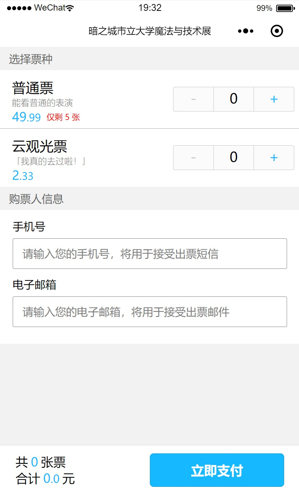
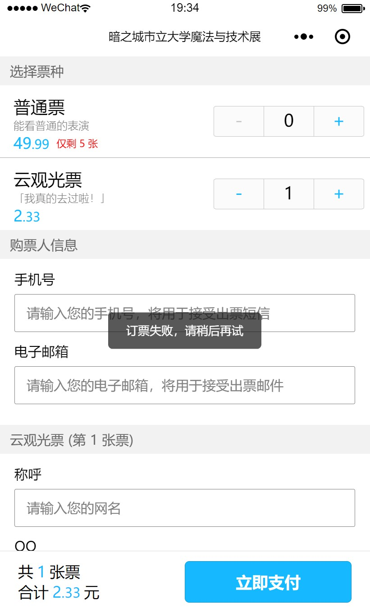

## Techs

使用了 [Taro](https://github.com/NervJS/taro) with Typescript 完成，以 Taro-cli 搭建的项目成功运行开始，到开始写该 Readme 为止，耗时 6 小时 15 分钟。

## 坑

介于是第一次接触 Taro 和小程序，在开发过程中遇到了不少的坑，一些是因为 Taro 将 JSX 转为 wxml 过程中的技术限制，另一些是因为微信小程序本身的坑。（有些还是 undocumented 的坑）

### 印象比较深刻的几个坑

#### JSX 表达能力受到严重限制

JSX 本身就是 React 表达能力强大的原因之一。为了编译到作为模板的 wxml，Taro 对可使用 JSX 的地方和使用方式都做出了限制。习惯了完整能力的 JSX 的表达方式之后，使用 Taro 感觉十分束手束脚。

#### .map( ) 的限制，和一些奇怪的问题

.map -> JSX 之后就不能再当数组用，这一点在 Taro 文档里有提到，虽然感觉很不方便，但是至少没有被坑到。但另一个问题就很令人匪夷所思了，（没有尝试复现，但观察到了相关性）。

```jsx
// 在参数处使用解构会炸
x.map(([a, b]) => <Text>{a}</Text>)
```

#### 作用域

Taro 的变量作用域的转换貌似是有坑，开发过程中出现了两次变量作用域错误导致的迷之 bug。

第一个是 shadowed variable 有坑；

第二个是**跨文件**（通过同一个组件关联起来）的两个变量互相干扰。这个问题造成的 bug 看起来真的是完全玄学，debug 了很久才发现问题所在。

#### 原生组件

微信小程序的文档里提到了 Input textarea 等是原生组件，会在别的内容上方，但是有 Cover View 可用。后来遇到的时候发现 CoverView 并没有什么用，最后换了布局方案绕过了这个问题。

#### 微信开发者工具

在沙盒里安装打开的。

作为一个开发者工具居然启动时需要**扫码**？！作为对微信的极度抗拒者，我差点就 I'm out 了，不过担心 Taro 的 web 模式和 weapp 模式表现不一，还是打开了。

应该是 Chrome 改，但体验超差，Dom View 和属性面板里很多操作不知道为什么都失效了。

## 结论

开发体验糟糕，但至少比直接去写 wxml 好。
微信小程序的设计显而易见的是垃圾。

Taro 很努力的把 React 的范式编译成 wxml，而且也还算成功。
但这种跨度过大的编译中间显然会也的确出现了不少限制和 bug，一个作用域问题就能浪费掉开发者半个小时。

最后引用 [BPC](https://github.com/benpigchu) 的一句话：

> 辣鸡微信，封闭体系，自我审查，破坏 Open Web，罪大恶极

支持 Open Web，支持 [PWA](https://developers.google.com/web/progressive-web-apps/)

## 应用截图


<br />

